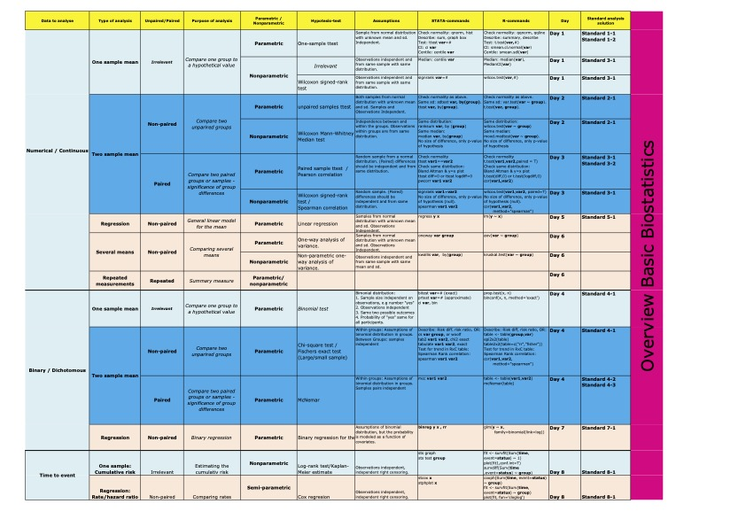

# Recommendations and inspiration {#recom}

Here follows a collection of suggestions on packages, pages and clever solutions

## Applications of R in Healthcare

This is a very thorough book introducing a very wide range of functions in R, beginning from scratch. The book is written by Thanh Phan (whom Anne has worked with[@behrndtzCanHelicoptersSolve2022]), [and is still a work in progress](https://github.com/GNtem2/HealthcareRbook).

I (andreas) have made a publishable fork of the work, which can be [accessed here](https://agdamsbo.github.io/HealthcareRbook/). Just note that not all examples are working do to missing data sets or references to non-maintained packages.

## More Advanced R

The Advanced R course at the PhD School at AU is based on this book: [Advanced R Course by Florian Privé](https://privefl.github.io/advr38book/index.html).

This is a really good collection of more advanced R-use with focus on using the tidyverse-packages and working efficiently. A lot of other external references are also included for further reading.

## PhD Biostat course CheatSheet

As part of the PhD BioStat course, the teacher, Eric Parner is providing a Data Analysis reference overview, or CheatSheet.

|  |
|:--:|
| Biostat CheatSheet - click to download - source: [Eric Parner, AU](https://pure.au.dk/portal/en/persons/erik-thorlund-parner(e20f05d3-5aaf-498a-a0f5-81e42dffcf41).html)|

## On geocomputation

Introduction to geocomputational work in R.

[link](https://geocompr.robinlovelace.net/)

## Inspiration for plots

Data can be visualised in many ways. Deciding on the best plot can be difficult. Here are some sources of insppiration:

*   Cheatsheet on [Grafics Principles](https://github.com/GraphicsPrinciples/CheatSheet/raw/master/NVSCheatSheet.pdf).

## On People Analytics

A "Handbook of Regression Modeling in People". 
The book is very recent (last update on 19 August 2022), with lots of example code and data. Code examples in both R, Python and Julia. All free and open source languages used in data analytics.

[Read it here.](https://peopleanalytics-regression-book.org/gitbook/index.html)

